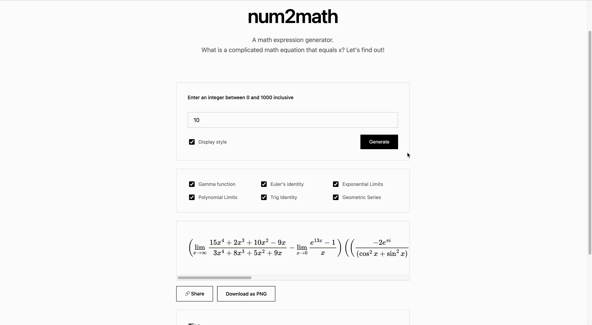

# num2math

A simple web app that generates a complicated math expression that results in a number. If you wanna do this for some reason.

Try it: https://enjeck.com/num2math/



## Run the app
To run the app locally:

```bash
git clone https://github.com/enjeck/num2math.git
cd num2math
npm install
npm run dev
```
